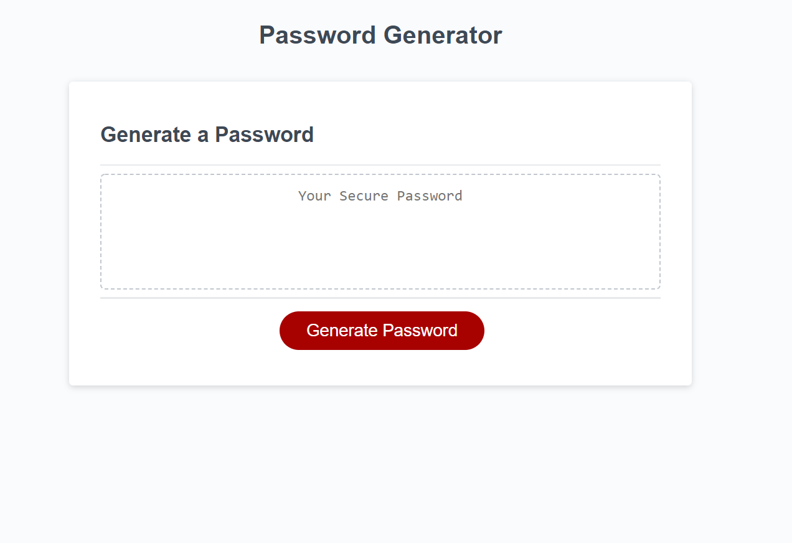

# homework3
Homework 3 - Password Generator
TEST TEST TEST
Created a password generator that's operable from the provided html. This current version also ensures user generated password contains at least once instance of every desired character and regenerates the password if those are not present.

Users press the generate password button and then receive a series of prompts allowing them to choose which types of characters they want to be included. Input is restricted to between 8 and 128 characters and input must be an integer. 

Application deployed at: https://myrmoxenus.github.io/homework3/

Screenshot: 

